# Practice Azure IOT Hub

----------------------------------------------------------------
## Process:
##### -We started session in Azure [Azure](https://www.portal.azure.com)
##### -In the search engine, we look for "IoT Hub" and click on create.
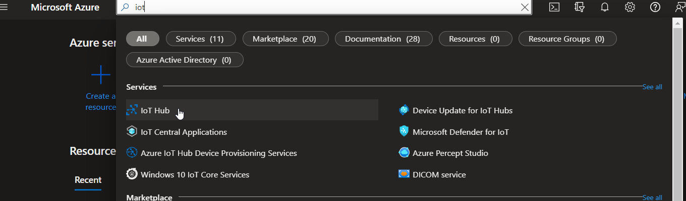
##### -Set a name, select a resource group, or create one, click on  review and create.
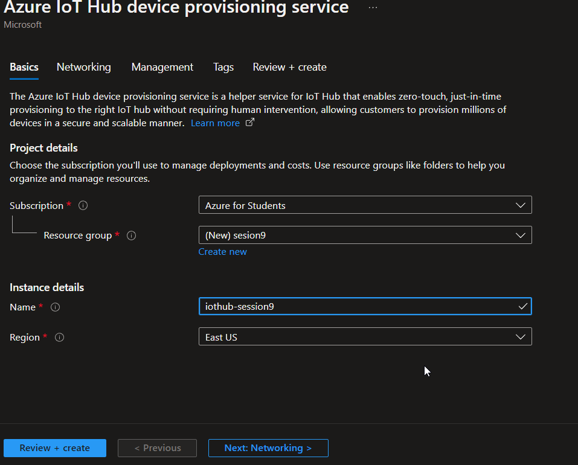
##### -Click on got to resource.
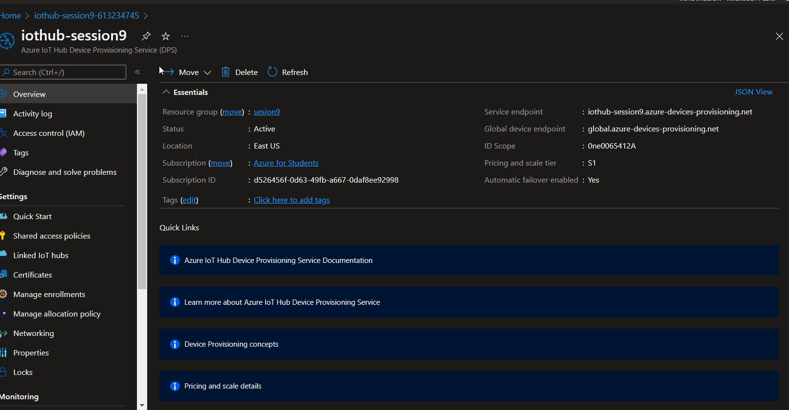
##### -Go to device, and click on create device.
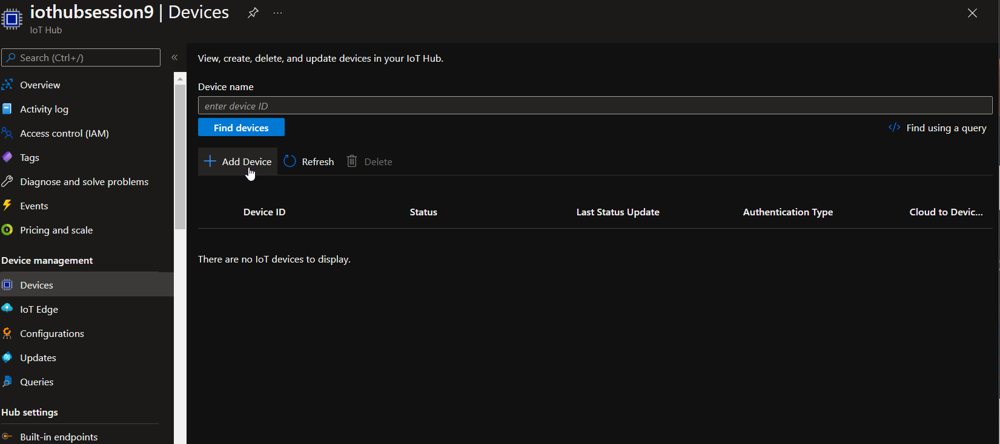
##### -Set a name an click on save.
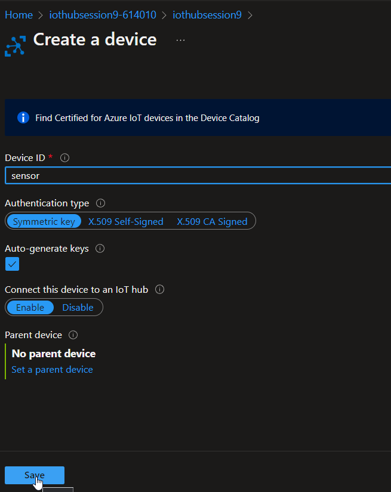
##### -Click on the name of your device.
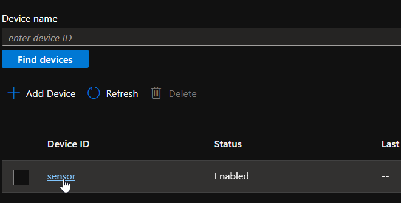
##### -We have to copy the Primary connection string.
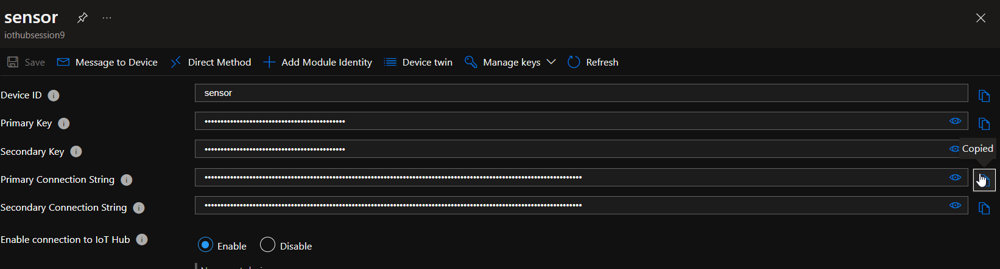
##### -We can to open the net [Link](https://azure-samples.github.io/raspberry-pi-web-simulator/#GetStarted)
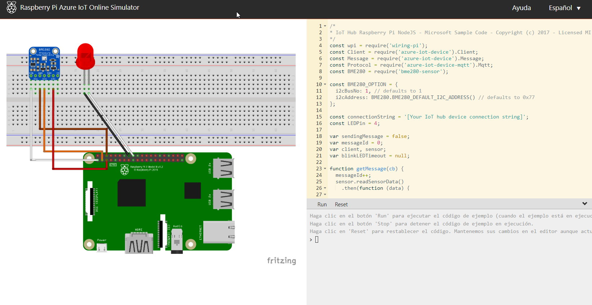
##### -In the 15 line, in const connectionString, paste the copy.
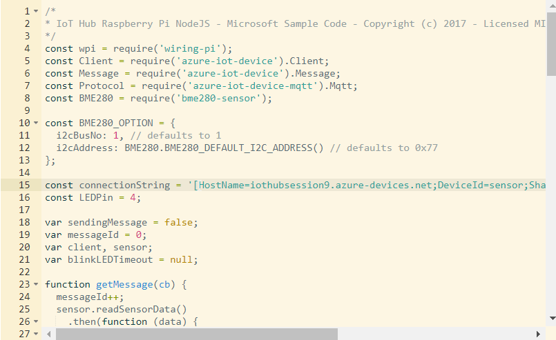
##### -Click on run.
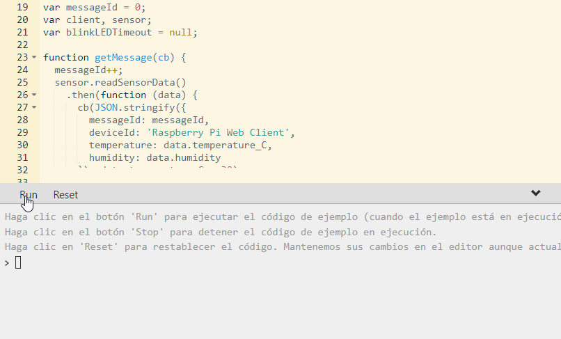
##### -Now, you can see how the led turns on and of.
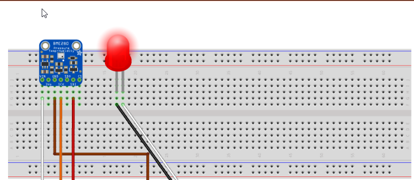
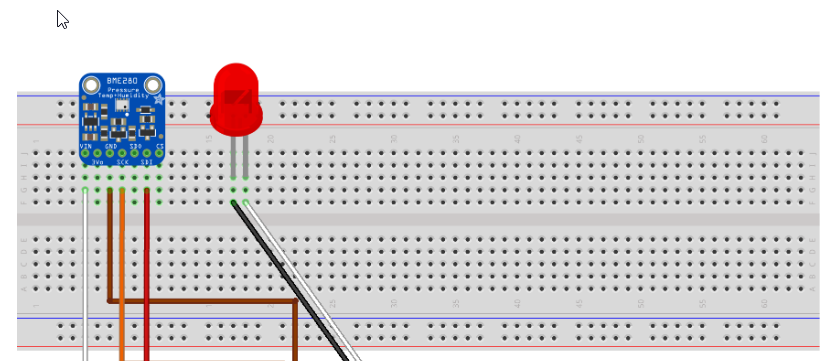
## 🔥🔥Congratulations...! you used an Azure  IoT Hub🔥🔥
